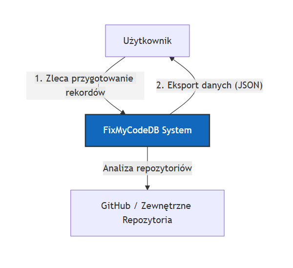
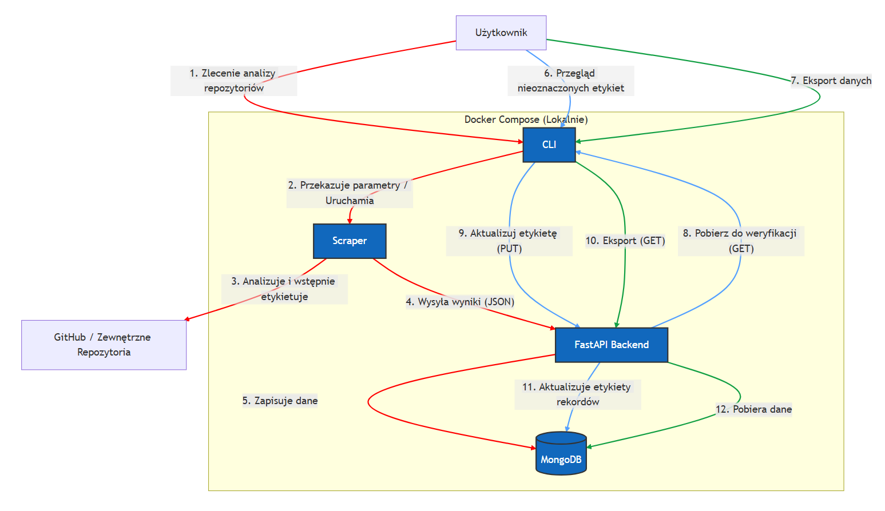
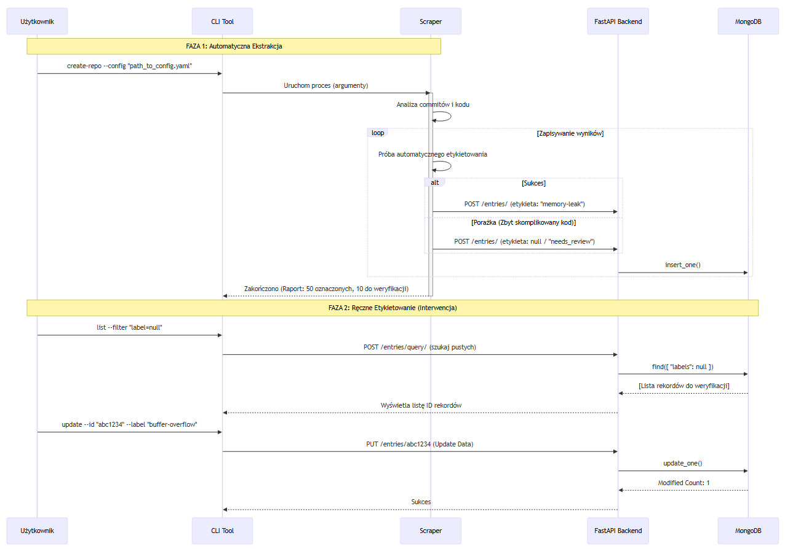

## Architektura Systemu FixMyCodeDB

Dokumentacja techniczna przedstawiająca strukturę systemu, przepływ danych oraz interakcje między komponentami.

### 1. Kontekst Systemu

System funkcjonuje jako pośrednik między użytkownikiem (badaczem/operatorem) a zewnętrznymi repozytoriami kodu, umożliwiając tworzenie i eksportowanie zbiorów danych.

### 2. Architektura Kontenerów (Lokalna)

System składa się z czterech głównych modułów uruchamianych lokalnie, które współpracują w celu automatycznej ekstrakcji i ręcznej weryfikacji danych.

### Opis Modułów

CLI Tool: Interfejs wiersza poleceń służący do sterowania procesem ekstrakcji danych (uruchamianie Scrapera) oraz zarządzania istniejącymi rekordami (ręczne etykietowanie, eksport). Pełni rolę frontendu dla użytkownika.

Scraper: Moduł wykonawczy, który automatycznie analizuje historię commitów pod kątem błędów i przesyła przetworzone wyniki do API. Działa jako "worker" uruchamiany na żądanie CLI.

FastAPI Backend (Core API): Centralny serwis REST API odpowiedzialny za walidację danych, komunikację z bazą oraz obsługę zapytań CRUD. Pośredniczy w wymianie danych między bazą a pozostałymi komponentami.

MongoDB (Database): Dokumentowa baza danych przechowująca pary kodu (code_buggy, code_fixed) oraz metadane i etykiety. Zapewnia elastyczny schemat danych niezbędny do obsługi zróżnicowanych struktur kodu.

### 3. Scenariusz: Analiza i Ręczna Interwencja

Diagram sekwencji obrazujący pełny cykl życia danych – od automatycznego wykrycia błędu przez Scraper, aż po ręczne uzupełnienie brakującej etykiety przez użytkownika.

