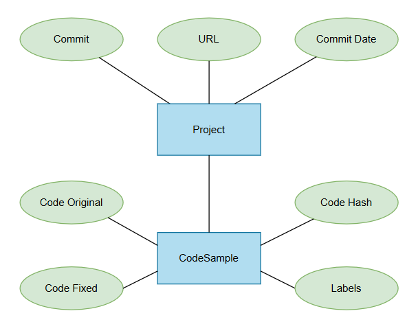

# Warstwa danych

### Ustalenia dotyczące reprezentacji danych trwałych

Przed rozpoczęciem implementacji sposób reprezentacji danych trwałych został skonsultowany z prowadzącym.
Ustalono wykorzystanie nierelacyjnej bazy dokumentowej MongoDB oraz modelu danych
odwzorowanego w pojedynczej kolekcji **code_entries**.

### Sposób reprezentacji danych trwałych
Wybrano bazę nierelacyjną **MongoDB**, ze względu na przechowywanie jednolitego, uporządkowanego formatu danych.

### Model pojęciowy



### Specyfikacja struktury dla bazy nierelacyjnej 
Wszystkie rekordy są przechowywane w kolekcji **code_entries**. Każdy dokument BSON odwzorowuje
instancję modelu **CodeEntry**.

Przykładowy dokument:

```json
{
  "_id": ObjectId("..."),
  "code_original": "...",
  "code_fixed": "...",
  "code_hash": "abc123",
  "repo": {
    "url": "https://github.com/firefox/firefox",
    "commit_hash": "def456",
    "commit_date": "2024-01-10T12:00:00Z"
  },
  "ingest_timestamp": "2024-01-15T09:30:00Z",
  "labels": {
    "cppcheck": {
      "nullPointer": 1,
      "logicError": 1
    },
    "clang": {},
    "groups": {
      "memory_errors": 1,
      "undefined_behavior": 0,
      "correctness": 1,
      "performance": 0,
      "style": 0
    }
  }
}
```

### Indeksy

W celu efektywnego filtrowania rekordów definiowane są następujące indeksy w kolekcji **code_entries**:

- indeks po hashu kodu: `{ "code_hash": 1 }`,
- indeks po etykietach: `{ "labels.cppcheck": 1, "labels.clang": 1 }`,
- indeks po dacie przetworzenia: `{ "ingest_timestamp": -1 }`.

Indeksy te odpowiadają typowym zapytaniom wykonywanym przez aplikację oraz zapewniają
spełnienie wymagań wydajnościowych analizy i wyszukiwania rekordów.

### Aktywne elementy bazy danych

W projekcie nie są wykorzystywane aktywne elementy bazy danych (triggery, procedury składowane).
Logika walidacji, etykietowania oraz aktualizacji danych jest zaimplementowana w warstwie aplikacyjnej. Rozwiązanie to upraszcza przenoszalność projektu oraz integrację z
narzędziami uczenia maszynowego.

### Komunikacja aplikacji z bazą danych

Warstwa serwerowa systemu jest zrealizowana jako usługa HTTP w oparciu o framework FastAPI. Usługa ta jest jedynym komponentem, który bezpośrednio komunikuje się z bazą MongoDB.

Warstwa kliencka jest zrealizowana jako aplikacja CLI, która pełni rolę interfejsu użytkownika. Aplikacja CLI nie łączy się z bazą danych bezpośrednio – wysyła
żądania HTTP do serwera FastAPI.

Schemat przepływu:

`użytkownik → CLI → FastAPI → MongoDB`

FastAPI udostępnia REST API dla operacji na kolekcji **code_entries**, m.in.:

- `POST /entries/` – utworzenie nowego dokumentu **CodeEntry**,
- `GET /entries/{entry_id}` – odczyt pojedynczego dokumentu po identyfikatorze,
- `GET /entries/` – odczyt wszystkich dokumentów,
- `PUT /entries/{entry_id}` – aktualizacja istniejącego dokumentu,
- `DELETE /entries/{entry_id}` – usunięcie dokumentu,
- `POST /entries/query/` – filtrowanie i sortowanie dokumentów według zadanych kryteriów.